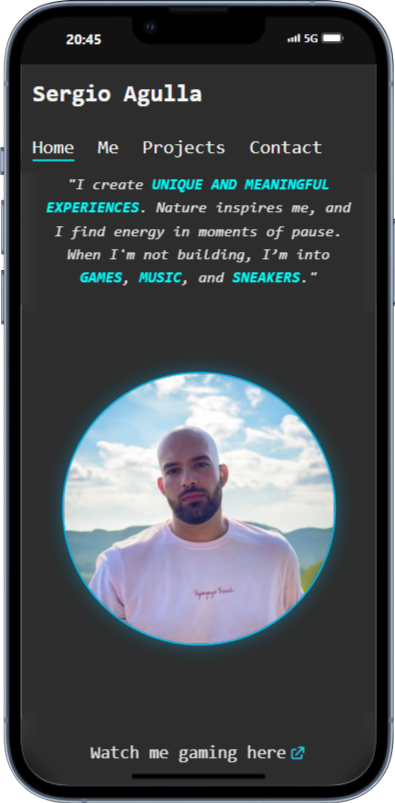
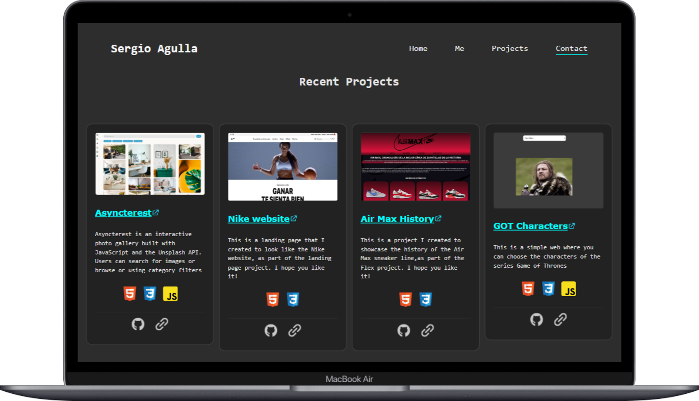

# 💼 CV 

Este proyecto es un portfolio personal tipo CV desarrollado como práctica con **Vite** y utilizando un sistema modular basado en componentes.
Este proyecto forma parte del **Máster en Desarrollo Fullstack**

 

---

## 🛠️ Tecnologías utilizadas

- ⚡ [Vite](https://vitejs.dev/) – Bundler ultra rápido
- 🧩 HTML + CSS + JavaScript
- 💻 Arquitectura basada en componentes
- 🎨 Diseño responsive con media queries
- 📦 Despliegue final en [Vercel](https://proyecto4-componentes.vercel.app/) 

---

## 🚀 Funcionalidades

- Navegación fluida por secciones.
- Tarjetas de proyectos con animaciones.
- Imagen de perfil optimizada y animaciones en scroll.
- Diseño totalmente responsive para escritorio, tablets y móviles.
- Footer con enlaces a redes sociales y contacto.

---

## 📄 Licencia

Este proyecto es personal y está publicado con fines educativos y profesionales. Puedes inspirarte o reutilizar partes del código dando crédito si te resulta útil. 

---

> Hecho con 💙 por [Sergio Agulla](https://www.linkedin.com/in/sergio-agulla/)
